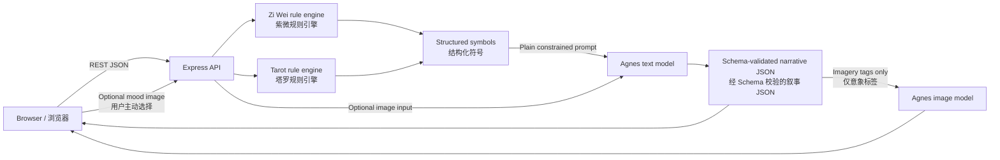

# Fate Fork architecture / 架构说明

> This document records the product's control boundaries. These boundaries are
> architectural requirements, not optional prompting preferences.
>
> 本文记录产品的控制边界。它们是架构约束，不是可以被模型提示词替代的偏好设置。

## System boundary / 系统边界

| Responsibility / 职责 | Deterministic application code / 确定性代码 | Agnes |
| --- | --- | --- |
| Time-zone normalization / 时区换算 | Yes / 是 | No / 否 |
| Twelve-palace and star placement / 十二宫与星曜计算 | Yes / 是 | No / 否 |
| Tarot shuffle, draw, orientation and spread positions / 洗牌、抽牌、正逆位与牌阵位置 | Yes / 是 | No / 否 |
| Empathetic, neutral narrative / 共情、中立叙事 | No / 否 | Yes / 是 |
| Mood-image interpretation / 心境图理解 | No / 否 | Optional / 可选 |
| Narrative and emotion JSON / 叙事及情绪元数据 JSON | Schema validation / Schema 校验 | Generation / 生成 |
| Abstract atmosphere image / 抽象氛围图 | Prompt and safety constraints / 提示与安全约束 | Generation / 生成 |

The application does **not** use RAG, vector databases, function calling, tool
calling, autonomous agents, or iterative agent loops. Every model request is a
single, explicit, server-authored instruction with a bounded JSON response.

应用**不使用** RAG、向量数据库、Function Calling、工具调用、自主 Agent 或 Agent
循环。每次模型请求都是由服务端编写的一次性受控指令，并要求返回边界明确的 JSON。

## Request flows / 请求流程

### Zi Wei / 紫微双轨

1. The browser submits birth input to the Express API only when the user starts
   a reading. / 用户主动开始推演时，浏览器才将生辰输入发送给 Express API。
2. Server code normalizes the time zone and calculates the structured chart. /
   服务端代码完成时区归一化与结构化排盘。
3. The narrative request supplies Agnes with the calculated symbolic structure
   and optional mood context. Raw birth fields are not required for prose
   generation. / 叙事请求只向 Agnes 提供已计算的符号结构与可选心境上下文，生成文案
   不需要原始生辰字段。
4. The validated response contains two equal-weight paths, timeline nodes,
   reflective questions, and emotion metadata. / 校验后的响应包含视觉权重相等的双轨、
   时间线节点、自省问题与情绪元数据。
5. Emotion metadata changes motion, glow, and line rhythm; it never labels
   either path as good or bad. / 情绪元数据只调节动效、明暗与线条节律，不将任一路径
   标注为好坏。

### Tarot / 塔罗镜像

1. Server code performs the shuffle and draw independently from Agnes. /
   洗牌与抽牌完全由服务端代码执行，与 Agnes 无关。
2. Agnes receives the user question plus the immutable draw result. /
   Agnes 只接收用户问题与不可改写的抽牌结果。
3. The model returns layered perspectives for the present, inner tension, and
   multiple possible developments. / 模型返回现状、内在张力与多重发展视角。
4. Follow-ups preserve the original draw as context; they do not redraw or let
   the model invent cards. / 追问沿用原抽牌上下文，不重新抽牌，也不允许模型虚构牌面。

### Open reflection / 随心闲谈

This path sends no Zi Wei or tarot symbols. It is a bounded reflective
conversation intended to help the user name trade-offs and possible next steps.

此通道不启用紫微或塔罗符号，只进行受控的思辨对话，帮助用户辨认取舍与下一步。

## Deployment shape / 部署形态

- Development: Vite serves the React client and proxies `/api` to Express. /
  开发环境由 Vite 提供前端，并将 `/api` 代理到 Express。
- Production and Render: one Node web service builds `client/dist`; Express
  serves both the REST API and the static single-page application. /
  生产环境与 Render 使用一个 Node Web Service：构建 `client/dist`，由 Express
  同时托管 REST API 与 SPA 静态文件。
- There is no server-side history database in the portfolio build. Saved
  sessions live in browser storage and can be deleted in the UI. /
  作品集版本不设服务端历史数据库；保存记录位于浏览器本地，并可在界面中删除。

## Failure behavior / 异常与降级

- Agnes credentials stay on the server and are never exposed through `VITE_*`
  variables. / Agnes 凭据只存在服务端，绝不放入会暴露给浏览器的 `VITE_*` 变量。
- The gateway applies a timeout, rate limit, normalized errors, JSON parsing,
  and schema checks. / 网关统一处理超时、限流、错误归一化、JSON 解析与 Schema 校验。
- With no API key, local development uses a clearly labelled deterministic mock
  provider. A mock response must not be presented as a live Agnes response. /
  未配置 Key 时，本地开发使用明确标记的确定性 Mock；Mock 结果不得伪装成 Agnes
  实时输出。
- If image generation fails, the narrative remains usable and the interface
  falls back to its native abstract gradient artwork. / 图片生成失败不阻断叙事，界面回退
  到内置抽象渐变视觉。

